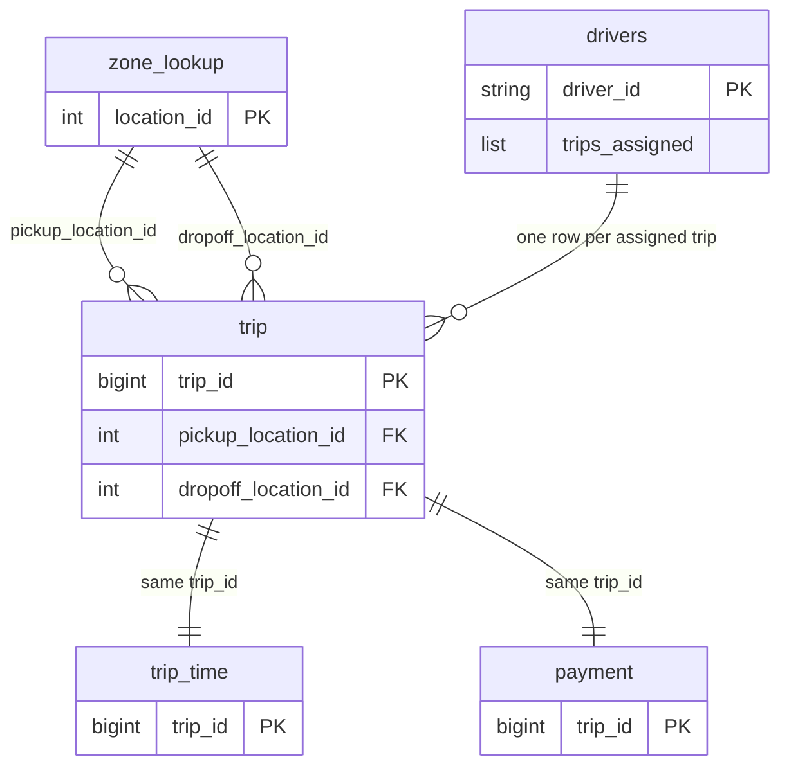
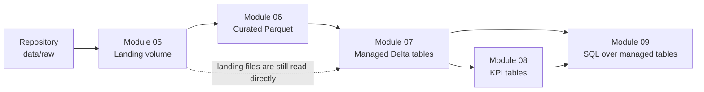
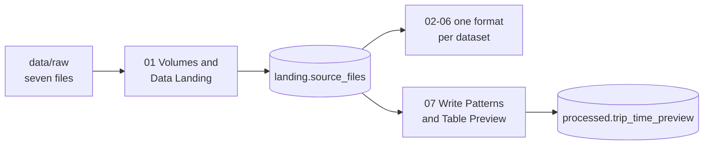
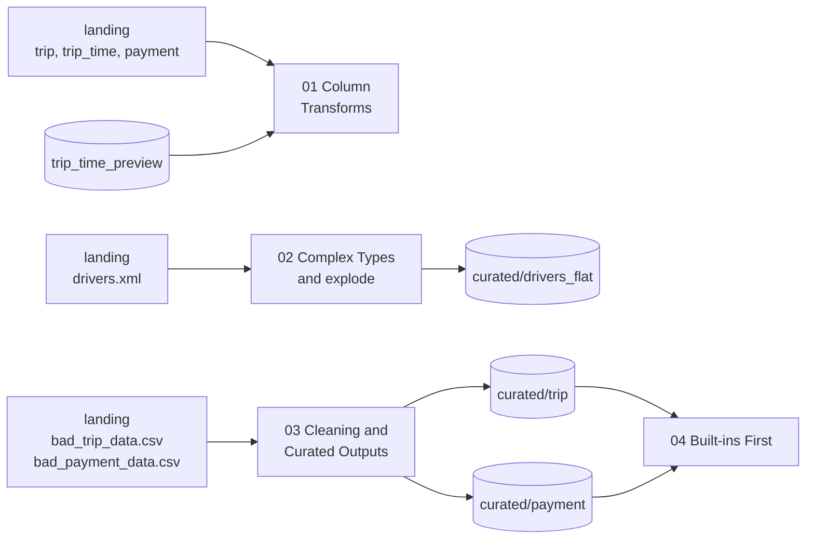
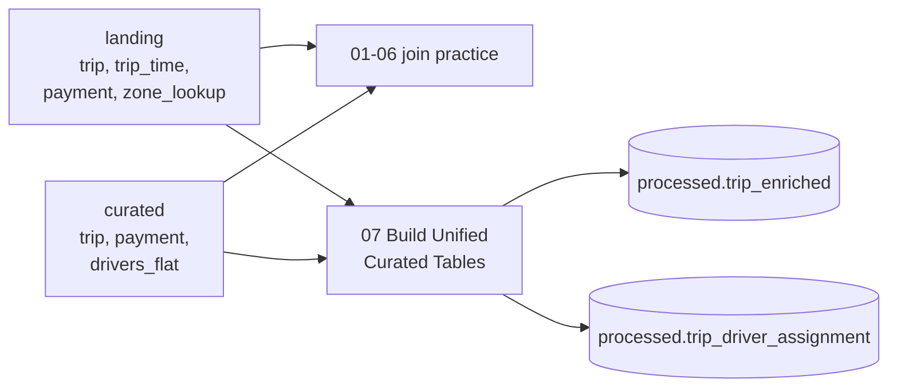
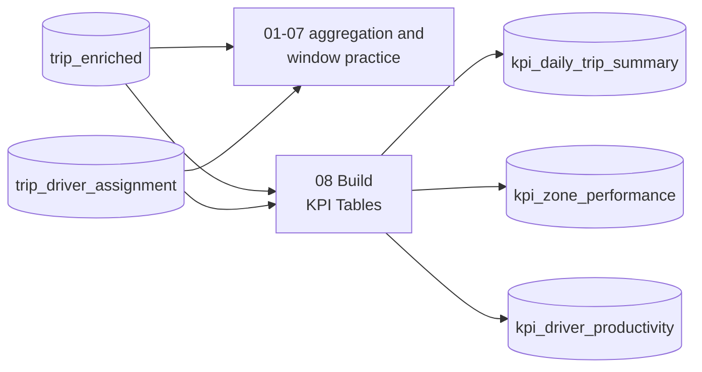
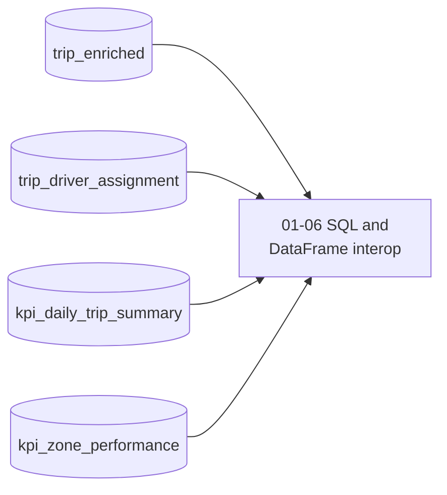

# Rideshare Dataset Guide

A plain-English introduction to the data model this course uses: what the tables
represent, how they relate, which data each module works with, and why row counts
and NULLs change as the pipeline runs.

This guide explains rather than defines. It names modules, datasets, tables, and
notebooks where that helps you follow the flow, but the exact schemas, column
types, row counts, join keys, NULL matrices, Volume paths, and Unity Catalog
object names live in [`dataset-overview.md`](dataset-overview.md), which is the
single source of truth. Where this guide and the overview disagree, the overview
is correct.

## Why this dataset

Every module uses the same rideshare data instead of switching examples, so once
you know what a trip record means, each new topic adds a technique rather than a
new problem domain — a join in Module 7 uses the same keys you filtered in
Module 3. The data is deliberately tiny, around a hundred trips, because small
data keeps feedback fast and makes wrong answers visible: you can reason about
what the correct row count should be before you run anything. Nothing here
depends on data volume; the patterns are the ones production pipelines use. The
data is also deliberately imperfect. Duplicated records, missing keys, and values
that cannot be parsed as numbers are planted, not accidental, and they are what
makes cleaning, NULL-safe predicates, and join-cardinality checks worth learning.

## How the tables relate

There is one central fact table of trips. Two tables extend it one-to-one, each
adding a different kind of detail about the same trip. One dimension table
describes locations and is looked up twice per trip — once for pickup, once for
dropoff. A supplementary nested file describes drivers, where each driver record
carries a list of the trips assigned to them.

Only keys are shown, to keep the shape readable. For the full column list of any
table, see [Core data model](dataset-overview.md#core-data-model).

Three things about this shape matter later:

- The extension tables are one-to-one on the trip key, so joining them should not
  change your row count. If it does, something is wrong — usually a duplicate
  key.
- Locations are looked up twice, so the dimension table is joined twice in the
  same query. That forces you to be deliberate about column naming and about
  which side you keep.
- A few rows in the location table describe places no trip ever visits. That is
  on purpose: it gives you a real unmatched-key case, so you can see the
  difference between an inner join and a left join instead of being told about it.

## The pipeline story

Modules 5 through 9 build a small pipeline and then query it, each stage feeding
the next.

Nothing is cleaned in Module 5; the files simply arrive, in five different
formats. Module 6 cleans and enriches them and flattens the nested driver
records. Module 7 is where join cardinality and unmatched keys stop being theory.
Module 8 comes last because an aggregate is only as correct as everything before
it. The dotted edge matters: reaching Module 7 does not mean the landing files
are finished with.

Modules 1 through 4 are not in this picture. They build small DataFrames in code,
aligned with these schemas, and read no files and no tables.

## What each module uses and creates

The names below are here to orient you. They are not the contract — exact
schemas, row counts, and object names live in
[`dataset-overview.md`](dataset-overview.md), and each module's own `README.md`
records its notebook list and design decisions. Only notebooks that move or
materially use the data appear here, and learner exercise output is left out.

### Module 5 lands the files

Notebook 01 is setup as well as landing: it creates the catalog, both schemas,
both volumes, and one folder per dataset before copying the files in, including
the two deliberately broken CSVs. Each dataset lands in exactly one format, which
is why notebooks 02 to 06 each read a different one — `trip` as CSV, `trip_time`
as Parquet, `zone_lookup` as JSON Lines, `payment` as Avro, `drivers` as XML.
Notebook 99 removes everything again.

### Module 6 curates

Notebook 01 practises transforms without writing anything, and it is the one
place a Module 5 table is read back. Notebook 03 is the only notebook whose trip
and payment inputs are the broken CSVs rather than the clean files. Notebook 04
reads Module 6's own curated output.

### Module 7 joins

Module 7 is not fed by curated data alone. Notebooks 01 and 02 read landing files
only, and even the build notebook takes `trip`, `payment`, and `drivers_flat`
from curated but `trip_time` and `zone_lookup` from landing, because no curated
version of those two exists.

### Module 8 aggregates

Every notebook here reads managed tables rather than files, and only notebook 08
writes.

### Module 9 queries the same tables in SQL

Module 9 creates nothing. It re-reads what Modules 7 and 8 built, which is the
point: the same questions, answered in SQL.

## Where the data lives

`landing` and `processed` are simply two Unity Catalog schemas, not quality
tiers. Bronze, Silver, and Gold are data layers designed later (Module 13);
Module 10 names them only to contrast those layers with managed vs external
table types. They are not Module 5 schema names. Inside the processed volume, `practice/` is where exercise
output goes, and `curated/` holds the pipeline output that later modules depend
on. Object names, which volumes are external, and when those folders appear are
recorded in
[Unity Catalog platform reference](dataset-overview.md#unity-catalog-platform-reference).

## Why row counts change along the way

Row counts are not constant through the pipeline, and each change has a reason.
Understanding the reason is the point; the exact numbers at each stage are in
[Module pipeline](dataset-overview.md#module-pipeline).

- **The broken input files are larger than the clean ones.** They keep every
  original record and append extra trips, a duplicate of an existing trip, and a
  row whose key is missing.
- **Cleaning removes some of those rows.** A row with no usable key cannot be
  joined or grouped, so it is dropped, and a duplicate is collapsed. That is why
  the curated output is smaller than its input but still larger than the original
  clean dataset.
- **The trip and payment stages end up with different counts.** One appended trip
  never received a payment record, so the payment side has one fewer row. That
  gap is what produces NULLs in the next stage.
- **Aggregates shrink sharply, and that is expected.** A KPI table has one row
  per day, per zone, or per driver, so its size reflects how many distinct groups
  exist, not how many trips there were.

## Why NULLs appear after joining

Most NULLs in this course are not missing source data. They are the visible
result of a left join that found no match: every row on the left survives, and
where the right table has no matching key, the columns it would have contributed
are filled with NULL. So the appended trips that have no time or payment record
come out of the join with NULLs in exactly those columns, and only those.

A second source is rejected values. When cleaning finds a value it cannot trust —
a negative fare, or text where a number belongs — it replaces that value with
NULL rather than guessing. The row stays; the untrustworthy field does not.

Two consequences worth carrying forward:

- NULL is not zero and not empty string. Some columns in this dataset use a
  literal `unknown` sentinel string instead, and the two behave differently in
  grouping and comparison. Which columns do which is recorded in the overview.
- Because NULLs are concentrated in known columns for known rows, you can always
  predict what a correct result looks like before running the query. The precise
  map of which columns are NULL for which trips is in
  [Module 7 — Joins and Set Operations](dataset-overview.md#module-7--joins-and-set-operations).

## Where the exact facts live

| Question | Answer lives in |
|---|---|
| Column names, types, and row contracts | [Core data model](dataset-overview.md#core-data-model) |
| Which keys join to which | [Join keys](dataset-overview.md#join-keys) |
| Nested driver fields | [Supplementary: `drivers`](dataset-overview.md#supplementary-drivers-nested-xml) |
| Source formats, Volume paths, and per-stage row counts | [Module pipeline](dataset-overview.md#module-pipeline) |
| Which columns are NULL and why | [Module 7 — Joins and Set Operations](dataset-overview.md#module-7--joins-and-set-operations) |
| Catalog, schema, volume, and table names | [Unity Catalog platform reference](dataset-overview.md#unity-catalog-platform-reference) |
